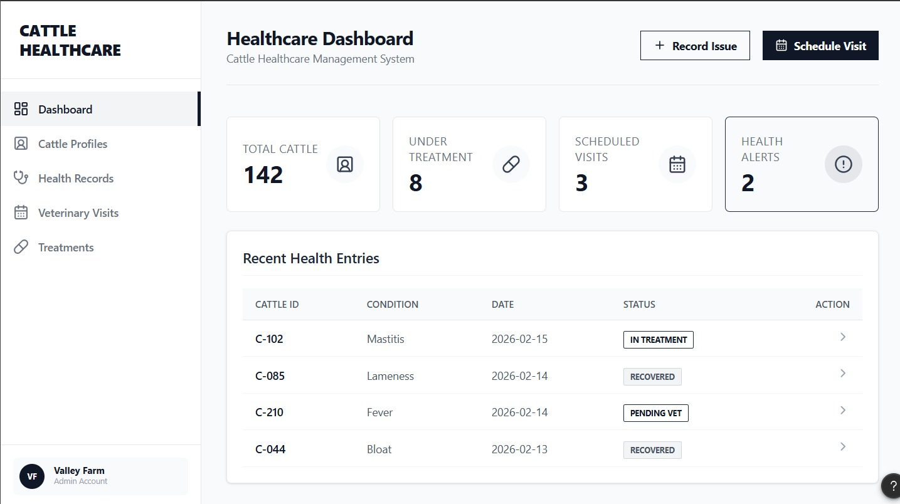
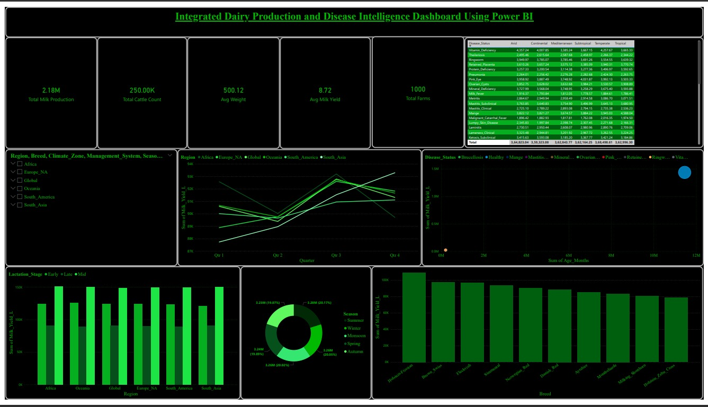

# 🐄 Health Management System for Dairy Cattle

A Business Analysis project focused on improving cattle healthcare management in dairy farms through structured record keeping and process standardization.

---

# 📌 Project Overview

The **Health Management System for Dairy Cattle** aims to address the challenges faced by dairy farmers in maintaining cattle health records.  
Many farms still rely on **manual observation and informal documentation**, which leads to inconsistent records, delayed treatment, and reduced productivity.

This project proposes a **structured health management framework** that allows farmers and veterinarians to maintain organized health records, track treatments, and coordinate veterinary visits efficiently.

---

# 🚨 Business Problem

Dairy farms currently face several operational challenges:

- Manual and fragmented health record keeping
- Difficulty tracking cattle treatment history
- Delayed identification of illnesses
- Lack of centralized medical records
- Limited coordination between farmers and veterinarians

These issues negatively impact **milk production, operational efficiency, and farm profitability**.

---

# 🎯 Project Objectives

The main objectives of this project are:

- Create a **centralized cattle health record system**
- Standardize **documentation of symptoms and treatments**
- Improve **coordination between farmers and veterinarians**
- Maintain **historical health records for each cattle**
- Provide **structured documentation processes**

---

# 👥 Key Stakeholders

### Dairy Farmer
- Records cattle health conditions
- Schedules veterinary visits
- Monitors treatment history

### Veterinarian
- Diagnoses cattle health issues
- Records treatment and medication
- Provides follow-up instructions

### System Administrator
- Manages system users
- Assigns roles and permissions

---

# ⚙️ System Features

- Create and manage **Cattle Profiles**
- Record **Health Conditions**
- Schedule **Veterinary Visits**
- Document **Treatment Details**
- Maintain **Treatment History**
- Record **Follow-up Instructions**
- **Role-Based User Access**

---

# 🧩 System Diagrams

## Use Case Diagram

  

---

## Swimlane Activity Diagram

  
---

# 🖥️ System Prototype

The prototype demonstrates the conceptual user interface for the cattle health management system.

  

---

# 📊 Power BI Dashboard

A **Dairy Production Dashboard** was developed using **Power BI** to visualize dairy farm data.

Features of the dashboard include:

- Milk production trends
- Cattle health monitoring
- Farm performance insights

  

---

# 🛠 Tools & Technologies Used

- Business Analysis Documentation
- UML Diagrams
- Microsoft PowerPoint
- Power BI
- GitHub

---

# 📄 Project Deliverables

- Business Requirements Document (BRD)
- Stakeholder Analysis
- Functional & Non-Functional Requirements
- Use Case Diagram
- Swimlane Activity Diagram
- System Prototype
- Dairy Production Dashboard

---

# 👨‍💻 Team Members

- Utkarsha
- Pooja
- Chinmay  
- Akash  
 

---

# 📚 Project Type

Academic Business Analysis Project

This project focuses on **requirements analysis and system modeling**, not on technical system implementation.

---

# ⭐ How to Use

1. Clone the repository
2. Review the documentation
3. Explore UML diagrams and prototype
4. View the Power BI dashboard visuals

---

# 📬 Contact

**Utkarsha Bhokare**  
📧 utkarshabhokare47@gmail.com
